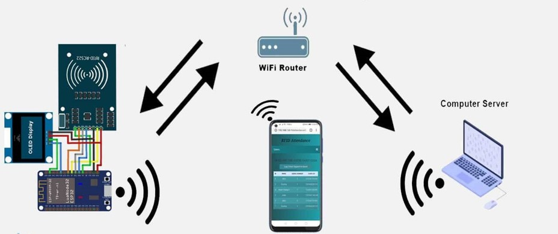
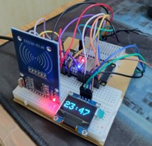
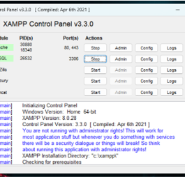
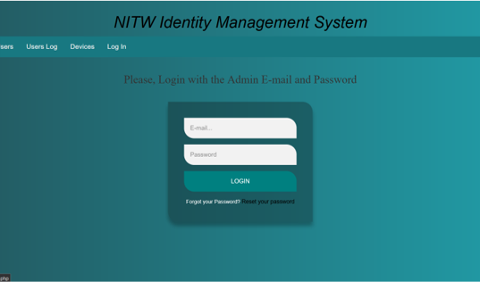

# RFID based Identity Management System - IoT implementation
This is a project done as part of a course titled **IoT & Cyber Physical Systems**, Department of ECE, NIT Warangal

# Project Outline
| Hardware components used           | Software components used             |
| ---------------------------------- |:------------------------------------:|
| ESP32 development board            | Arduino IDE                          |
| RFID RC522 reader module           | XAMPP server                         |
| SSD1306 OLED 128X64 display module | PHP source code                      |
| Male-to-male jumper wire X 11      | RFID RC522 library                   |
| Solderless breadboard mini X 2     | ESP32 library and board manager      |
|                                    | Adafruit SSD1306 library             |

# Technologies Used
- Embedded C
- PHP
- MySQL
- Apache 2 server (XAMPP)
- Javascript
- CSS

# Network Topology

# Interfacing of the components

| ESP32 to RC522 PIN layout   |     ESP32 to SSD1306 Display PIN layout |
| --------------------------- |:---------------------------------------:|
|     D2 -> SDA               |       GND -> GND                        |
|     D18 -> SCK              |       VIN -> VCC                        |
|     D23 -> MOSI             |       D22 -> SCL                        |
|     D19 -> MISO             |       D21 -> SDA                        |
|     GND -> GND              |                                         |
|     D5 -> RST               |                                         |
|     3V3 -> 3.3V             |                                         |

# Steps to implement

1. Deploy MySQL and Apache server from the XAMPP control panel
2. Configure localhost of the server with the MySQL database. After creating the database, go to `http://localhost/nitw-ims/` [^note]
3. Set up ArduinoIDE for the ESP32 development board
3. Connect the ESP32 board via USB and upload the source code sketch `source/source.ino`
4. Admin account and user accounts are to be updated on the database hosted on the local server. Default credentials: email: `admin@gmail.com`, password: `123`
5. Do test runs with different RFID cards/tags

[^note]:
    Source repo for the database files: [reference](https://github.com/InfinityWorldHI/RFID-Attendance-system-V2.0)